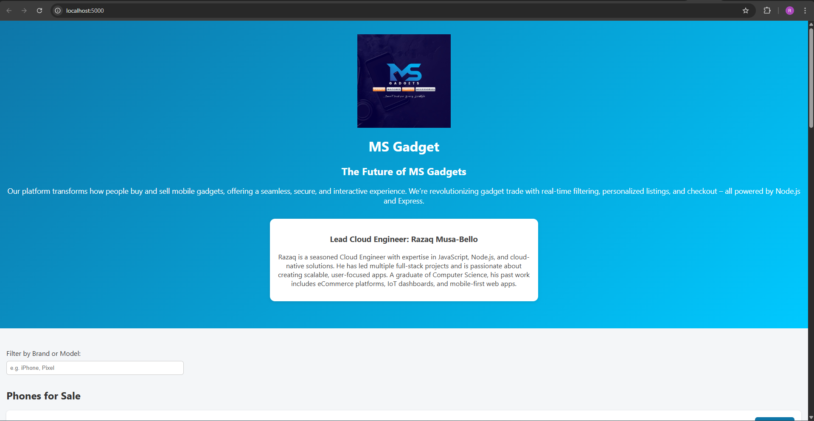

# Startup Prototype – The Future of MS Gadgets

## Description

A dynamic landing page to showcase cloud deployment, Node.js backend, and Nginx reverse proxying for a real-world investor-facing prototype.

## Public IP

<http://13.40.191.98> or <https://msgadget.link>

## Screenshot

## Setup Summary

### Server Provisioning

- AWS EC2 (Ubuntu 22.04)
- Security group with ports 22, 80, 443 open

### Web Server

- Node.js + Express.js backend
- Nginx reverse proxy to Node.js

### Web Content

- Personalized landing page
- CSS
- Interactive and responsive layout

### SSL

- Let’s Encrypt via Certbot for HTTPS

## How to Deploy

1. Clone repo
2. Install dependencies
3. Run `node server.js`
4. Configure Nginx
5. Deploy and verify via browser
